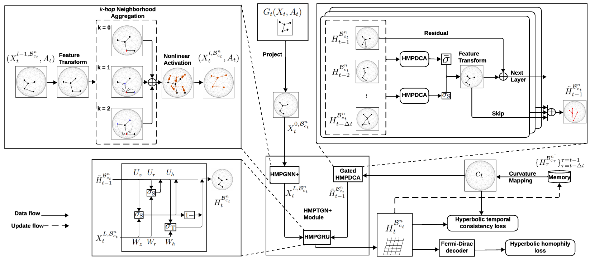

## 1. Overview

This is the Pytorch implementation for HMPTGN+

Authors: Viet Quan Le, Viet Cuong Ta

Paper:



## 2. Setup

### 2.1 Environment
`pip install -r requirements.txt`

### 2.2 Datasets
The data is cached in `./data/input/cached`.

## 3. Experiments
3.0 Go to the script at first

```cd ./script```

3.1 To run HMPTGN:

```!python run_hmptgnplus.py  --model=HMPTGNplus --dataset=enron10 --lr=0.02 --seed=998877 --max_curvature=5 --min_curvature=0.1 --spatial_order=2 --hmp_casual_conv_depth=2 --hmp_casual_conv_kernel_size=2```

3.2 Seed: 998877, 23456, 900.

3.3 Dataset choices: disease, enron10, dblp, uci, mathoverflow, fbw.

## 4. Baselines
For the baselines, please follow these repos and papers:
- [HGWaveNet](https://github.com/TaiLvYuanLiang/HGWaveNet)
- [HTGN](https://github.com/marlin-codes/HTGN)
- [VGRNN](https://github.com/VGraphRNN/VGRNN)
- [EvolveGCN](https://github.com/IBM/EvolveGCN)
- [DySAT](https://github.com/FeiGSSS/DySAT_pytorch)
- [DHGAT](https://doi.org/10.1016/j.neucom.2023.127038)
